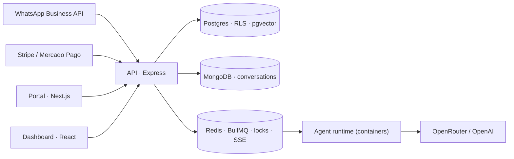

# LuckAgents

An AI assistant that lives on a small business's WhatsApp number. It answers customers, books appointments and can charge them. I built it end to end between 2024 and 2026, got it through Meta's review as a WhatsApp Tech Provider and ran my own security audit on it. The code is private; this note is how it's put together and what the audit found.

## Shape

A pnpm and Turborepo monorepo with 10 workspaces. A Next.js portal, a React/Vite dashboard, an Express API, and an agent runtime that runs in containers. Postgres on Supabase holds tenant data, with row-level security and pgvector for RAG. MongoDB holds conversations. Redis holds the queues, the locks and the SSE fan-out, and 20 BullMQ workers pull messaging, billing and AI jobs from it. Deploys went to Vercel and Railway with Docker. OpenTelemetry and Sentry were wired in with the first feature.

## Decisions I'd make again

**Isolation lives in the database.** Filtering by `tenantId` in every controller means every query is a chance to leak. The boundary is 31 RLS policies in Postgres that require an active membership. The runnable version is [pg-tenant-rls](https://github.com/joshua-angulo/pg-tenant-rls).

**Every external effect happens once.** Stripe, Mercado Pago and WhatsApp all redeliver webhooks. Each effect runs under an idempotency key, cross-instance sections take a Redis lock, and a webhook gets its signature checked and saved as a receipt before the API answers. When the system isn't sure, it skips. Not doing something is easier to fix than doing it twice.

**Agents can act, and they can give up.** They call tools to book and charge, answer from the business's own documents through RAG, and transcribe voice notes. When the model fails or the request is out of scope, a person gets the conversation. Each tenant's AI budget is reserved before every paid call so one tenant can't run up everyone's bill.

**Streaming goes over SSE.** Replies only flow one way. SSE reconnects on its own, gets through corporate proxies and carries the same traces as the rest of the API.

**No secrets in git.** External secrets manager, templates without values in the repo, and a pre-commit scan that blocks anything it can't verify.

## The audit (July 2026)

I went through the whole monorepo as if it were someone else's code.

- Members in `suspended` or `invited` state could still read tenant data. Every endpoint was right; the policies never checked status. I rewrote all 31, and every permission change now ships with a negative test.
- A legacy OAuth flow next to SSO trusted the identity the client sent. That's an account takeover. Removed.
- 155 vulnerable dependency paths, 4 of them critical. Now 0, with CodeQL and dependency review in CI.

1,066 tests pass in CI: API, dashboard unit and UI, and Playwright e2e in Chromium and Firefox.

## What I'd do differently

- Write the RLS policies before the endpoints, each with a query that should fail and does.
- Treat environment variables as a checked contract from day one, before three apps drift apart.
