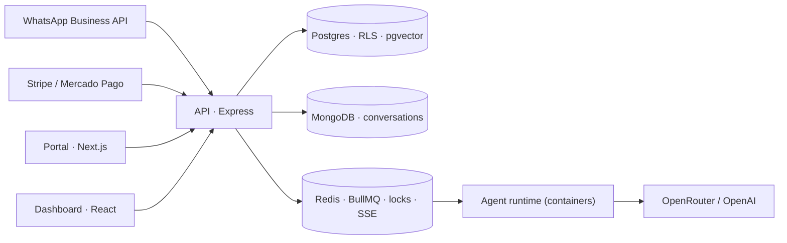

# LuckAgents

A SaaS that puts an AI assistant on a small business's WhatsApp number. The assistant answers customers, books appointments and takes payments. I've been building it alone since 2024. It is tested and Meta-approved, and it has not launched to paying customers yet. The code is private; this is how it's put together and what I got wrong.

## Shape

A pnpm and Turborepo monorepo with 10 workspaces: a Next.js portal, a React/Vite dashboard, an Express API with 42 route modules, and an agent runtime that runs in containers. PostgreSQL on Supabase holds tenant data (row-level security, pgvector for RAG), MongoDB holds conversations, Redis holds queues, locks and the SSE fan-out. 20 BullMQ workers handle messaging, billing and AI jobs. Deploys go to Vercel and Railway with Docker. OpenTelemetry, Sentry and Prometheus were wired in from the first feature, not bolted on at the end.

## Decisions

**Tenant isolation is in the database.** Filtering by `tenantId` in every controller means every query is a chance to leak. The boundary is 31 RLS policies in Postgres that require an active membership. Pulled out as a runnable repo: [pg-tenant-rls](https://github.com/joshua-angulo/pg-tenant-rls).

**Every external effect happens once.** Stripe, Mercado Pago and WhatsApp all redeliver webhooks. Each effect runs under an idempotency key, cross-instance sections take a Redis lock, and a webhook is signature-checked and saved as a receipt before the API answers. Payments are reconciled against each provider afterwards. When the system isn't sure, it skips: not doing something is easier to fix than doing it twice.

**Agents can act, and can give up.** They call tools to book and charge, answer from the business's own documents through RAG, and transcribe voice notes. When the model fails or the request is out of scope, the conversation goes to a person. Each tenant's AI budget is reserved before every paid call so one customer can't run up everyone's bill.

**SSE, not WebSockets, for streaming replies.** Replies only flow one way. SSE reconnects on its own, passes corporate proxies and carries the same traces as the rest of the API.

**Secrets never touch git.** External secrets manager, templates without values in the repo, and a pre-commit scan that blocks anything it can't verify.

## The pre-launch audit (July 2026)

Before launching I went through the whole monorepo as if I were reviewing someone else's. What it found:

- Members in `suspended` and `invited` state could still read tenant data. Every endpoint was correct; the policies never checked status. All 31 were rewritten, and every permission change now ships with a negative test.
- A legacy OAuth flow next to SSO trusted the identity the client sent. That was an account-takeover path. Removed.
- 155 vulnerable dependency paths (4 critical). Now 0 known advisories, with CodeQL and dependency review in CI.

At the end, 1,066 tests pass in CI: API, dashboard unit and UI, and Playwright end-to-end in Chromium and Firefox. I still haven't launched. Two external checks (connectivity to the managed database cluster and to Redis on the hosting provider) and a recovery path that has actually been exercised come before real customers. A green CI run by itself doesn't get a system that charges money to production.

## What I'd do differently

- Write the RLS policies before the endpoints, each with a query that should fail and does.
- Treat environment variables as a checked contract from day one, before three apps drift apart.
- Decide what "ready to launch" means at the start, external checks included, instead of under pressure at the end.
